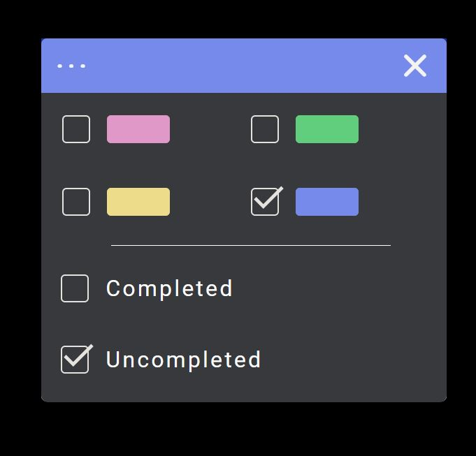
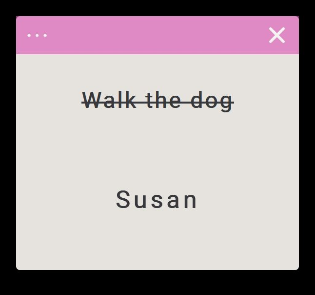
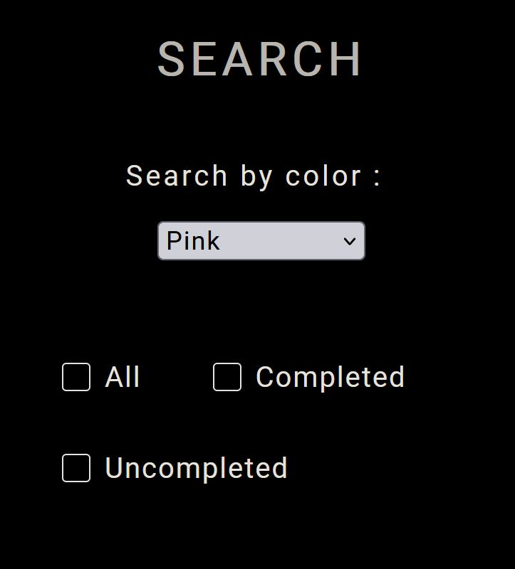
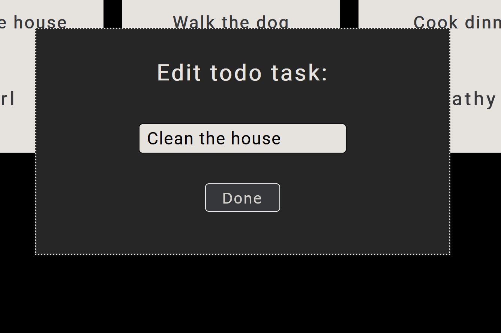

# Todo List with, Mongodb and Mongoose

## Click the dots in the upper left corner to show the menu. Your can change colors on your Todo and mark it as completed/uncompleted

## When you mark the Todo as completed it gets a line through it.

## You can search for a specific Tood by color or clicking the checkboxes based on what you want to show

## You can edit the text of your Todo by clicking on the text. A window will appear when you do so.

